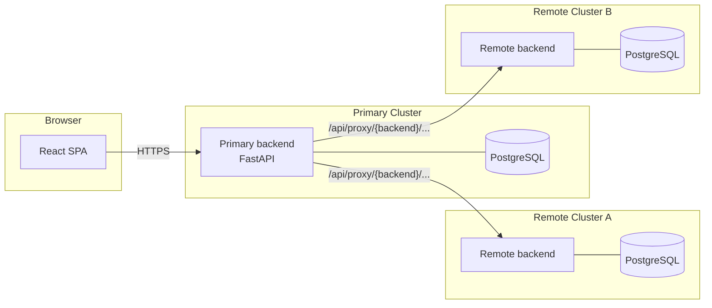

# Architecture

This document describes how the **K8s Third-Party Version Tracker** works. It is written against
the current codebase and supersedes all earlier design/implementation notes.

> See [INSTALLATION.md](INSTALLATION.md) for how to deploy and configure the system.

---

## 1. Overview

The system tracks third-party / open-source container images running across one or more Kubernetes
(OpenShift) clusters: their **current vs. latest version**, **version diff**, **end-of-life (EOL)**
dates, and **vulnerabilities** (Trivy + Twistlock). It also lets operators **patch images**, **compare
two clusters**, and visualize everything in a dashboard and a landscape view.

**Tech stack**

| Layer    | Technology |
|----------|------------|
| Backend  | FastAPI (Python 3.11), SQLAlchemy |
| Database | PostgreSQL (one per backend) |
| Frontend | React 18 + TypeScript (Vite), served by nginx |
| Packaging| Docker, Helm chart, OpenShift manifests |
| Security | Trivy (server) + Twistlock / Prisma Cloud |

**Key design principles**

- **API-first / DB-isolated frontend.** The React SPA never connects to PostgreSQL; it only calls the
  backend HTTP API (and, for remote clusters, a backend-side proxy).
- **Federation by replication, not a shared DB.** Each backend owns its **own** PostgreSQL and watches
  its **own** cluster in-cluster. There is no shared database.
- **Eventually-fresh data.** A nightly cron sync is the baseline; a real-time Kubernetes watch keeps
  data fresh between syncs.

---

## 2. Federation model

A deployment is **one primary backend + N remote (secondary) backends**. Each backend is a full copy
of the same application connected to its own database and Kubernetes cluster.

| | Primary | Remote (secondary) |
|---|---|---|
| `BACKEND_TYPE` | `primary` | `secondary` |
| `BACKEND_IS_DEFAULT` | `true` (auto-approved) | `false` |
| Owns | users, roles, global config, shared product list | only its own resources |
| Watches | its own cluster | its own cluster |
| Frontend talks to | this backend directly | only via the primary's proxy |

### Aggregation — streaming reverse-proxy + frontend fan-out

The frontend only ever points at the **primary**. To show data from every cluster it:

1. Loads the list of enabled backends (`GET /api/backend-endpoints`).
2. Fans out in **parallel** to each backend through the primary's streaming reverse-proxy:
   `GET /api/proxy/{backend_name}/api/resources?slim=true`
   ([multiBackend.ts](../frontend/src/services/multiBackend.ts)).
3. Merges the results client-side, tagging each row with its source backend.

The proxy ([routers/auth.py](../backend/app/routers/auth.py) `proxy_to_backend`) streams bytes through
without parsing JSON (low memory). For the primary's own data it loops back to `localhost`; for a
remote it forwards to the remote's `api_url` with an `X-Backend-Token` header.

### Shared configuration

Global settings (managed products, security thresholds, Twistlock/SMTP/LDAP config) live **only on the
primary**. Remote backends fetch them via `GET /api/federation/config` and cache them in-process
([config_cache.py](../backend/app/services/config_cache.py)). Each backend can override where a given
concern is resolved using per-backend **`*_mode`** flags on its registry row
(`latest_version_mode`, `twistlock_mode`, `trivy_mode`, `eol_mode`, `llm_mode`, `ldap_mode`): `local`
means "do it here", `primary` means "delegate to the primary".

### Registration & authentication

- **Backend identity.** A remote backend self-registers on startup
  ([federation.py](../backend/app/services/federation.py) → `POST /api/federation/register`) using a
  pre-shared `BACKEND_AUTH_TOKEN`. The primary stores it in `backend_endpoints` and marks it
  `approved`. Subsequent proxy calls authenticate with the `X-Backend-Token` header.
- **User identity.** User JWTs are issued by the **primary**. Remote backends validate a presented JWT
  via `POST /api/federation/validate-token` rather than holding their own user store.

---

## 3. Data model

Each backend has the full schema, but some tables are only meaningful on the primary.

**Primary-authoritative** (global): `users`, `roles`, `config` (key/value), `user_charts`,
`email_recipients`, `ldap_config`, `comparison_reports`, `backend_endpoints`, `product_list_table`.

**Per-backend** (each backend's own data): `resources`, `resource_history`, `resource_plans`,
`sync_logs`, `managed_product_list`, `image_update_jobs`, `image_update_results`.

Notable `resources` columns:
- `image`, `current_version`, `latest_version`, `version_diff`, `eol_date`, `replicas`, `product_name`.
- `security_info` (JSONB) — full scan output (per-container Trivy/Twistlock, CVEs, advice).
- `sec_summary` (JSONB) — **precomputed compact** projection of what the grid needs (see §6).
- `watch_spec_hash` — last container-spec hash the real-time watch refreshed on (see §5).
- `manifest_yaml` / `related_objects` — cached manifests used by Compare.

`resource_history` records a row **only when an image/version actually changes**, with a `source`
label (`watch`, `cron`, `manual`, `job`, `sync-backfill`).

---

## 4. Sync — keeping data fresh

There are three ways resource data is refreshed; all converge on
[refresh.py](../backend/app/services/refresh.py) `refresh_from_sources()` → `_do_refresh()` which, per
resource: reads the live image from Kubernetes, resolves the latest version, computes the diff, fetches
EOL, runs Trivy + Twistlock, and upserts `resources` + `resource_history`.

1. **Nightly cron / scheduled sync** — a background loop per backend (interval or cron expression),
   the baseline that guarantees completeness.
2. **Manual sync** — from the UI (`POST /api/resources/refresh`), optionally per product/resource.
3. **Real-time Kubernetes watch** — see §5.

Each backend syncs **independently and in parallel**; the frontend simply re-fetches and re-merges.

---

## 5. Real-time Kubernetes watch

[kube_watch.py](../backend/app/services/kube_watch.py) (enabled with `ENABLE_KUBE_WATCH=true`) watches
Deployments/StatefulSets/DaemonSets in the backend's own cluster and refreshes a resource within
seconds of a real change — complementing the cron baseline.

Design points that keep it correct and cheap:

- **Watches its own cluster only** (in-cluster API); fits the federation model. RBAC grants the
  `watch` verb (see the chart's `rbac.yaml`).
- **Container-spec dedup.** It refreshes only when the **watched product's own container** spec changes
  (image/env/args/resources). A sidecar product (e.g. fluentbit) is *not* re-scanned when an unrelated
  app container churns, and pod rollout/status churn is ignored.
- **Full single-resource refresh.** A change enqueues a complete refresh (version + manifest + EOL +
  Trivy/Twistlock) scoped to that one resource, via `refresh_from_sources(target_items=[...])`.
- **Bounded worker queue.** Watch threads only enqueue; a small worker pool (`KUBE_WATCH_WORKERS`,
  default 2) processes refreshes, deduping per resource — so a mass simultaneous update never lags the
  watch stream or floods external scanners.
- **Active-job guard.** While an image-update job is patching a product, the watch skips it (the job
  updates the row itself) to avoid races/history noise.
- **Restart-safe dedup.** The triggering container hash is persisted to `resources.watch_spec_hash` and
  the in-memory state is seeded from the DB on startup, so a restart does **not** re-refresh unchanged
  resources. Resources changed while the backend was down still differ and get refreshed.
- **No SyncLog noise.** Watch refreshes do not create `sync_logs` rows (they would bury the
  nightly/manual entries); the change is recorded in `resource_history` with `source=watch`.

---

## 6. Security scanning & the grid fast-path

- **Trivy** (server, pinned to 0.71.0) and **Twistlock / Prisma Cloud** produce per-image
  vulnerability data, stored in `resources.security_info` (JSONB). This blob can be large (many CVEs).
- The Resources grid does **not** read that large blob. During refresh the backend computes a compact
  `sec_summary` (distributions, risk-factor counts, advice, trimmed container list) — exactly what the
  grid renders. The list endpoint reads only `sec_summary`, which keeps the listing fast and avoids
  repeatedly de-TOASTing the big JSONB.
- **Lazy detail.** Full per-CVE security detail and change history are fetched on demand when the user
  opens the Security / Change History modals (`/api/federation/resource-detail`,
  `/api/resources/{id}/history`) — not in the initial grid payload.

### LLM advice (optional)

[llm_advice.py](../backend/app/services/llm_advice.py) can generate two kinds of natural-language
advice via any **OpenAI-compatible** chat API (local or hosted): **security advice** (from the CVE/EOL
findings) and **upgrade advice** (upgrade path, breaking changes, migration steps). It is **disabled by
default**.

- **Configuration** lives in `config` (ConfigKV, `llm_providers`): `enabled`, `base_url`, `model`,
  `api_key` (stored **encrypted**), `max_tokens`, `temperature` — set in the Admin UI, not via env.
- **Prompts** are customizable: the system prompts (`llm_prompt_security`, `llm_prompt_upgrade`) are
  stored in ConfigKV with built-in English defaults; the per-resource user message is built from the
  scan data. Output is cached and rate-limited.
- **Federation:** config and prompts live on the **primary**; secondaries fetch them via the config
  cache, or resolve locally per the `llm_mode` flag.

---

## 7. Feature flows

- **Resources** — the main grid: version/diff, EOL, security badge, replicas, notes, upgrade plans.
  Loaded slim (via `sec_summary`); history/security detail lazy-loaded.
- **Update Image** — create image-patch jobs with an approval workflow; the executor patches the
  workload, monitors rollout health, and rolls back on failure
  ([image_update.py](../backend/app/services/image_update.py)).
- **Compare** — diff manifests of the same product between two clusters using DB-cached
  `manifest_yaml`/`related_objects` (no live K8s calls) ([compare.py](../backend/app/routers/compare.py)).
- **Landscape** — hierarchical product/version/EOL view derived from the live resource list.
- **Dashboard** — charts (products, namespaces, EOL, security risk) + user-defined charts.
- **Sync** — view nightly/manual sync logs and trigger syncs (watch refreshes are excluded here).

---

## 8. Frontend boundary

The SPA ([frontend/src/](../frontend/src/)) holds no database credentials and issues no SQL. Every read
goes through the backend API or the `/api/proxy/{backend_name}/...` reverse-proxy; writes go to the
owning backend (routed by the resource's source backend). This keeps credentials server-side and lets
the frontend scale as stateless static assets behind nginx.

---

## 9. Glossary

- **Backend** — one FastAPI app + its PostgreSQL, managing one Kubernetes cluster.
- **Primary** — the default backend; owns users/config and proxies/aggregates the others.
- **Remote / secondary** — an additional backend for another cluster, federated to the primary.
- **Platform** — a cluster identifier (e.g. `main-cluster`, `prod-openshift`).
- **Managed product** — a tracked third-party product, matched to workloads by image pattern.
- **Sync** — scan a cluster and update the database.
- **Watch** — the real-time Kubernetes watcher (`kube_watch`).
